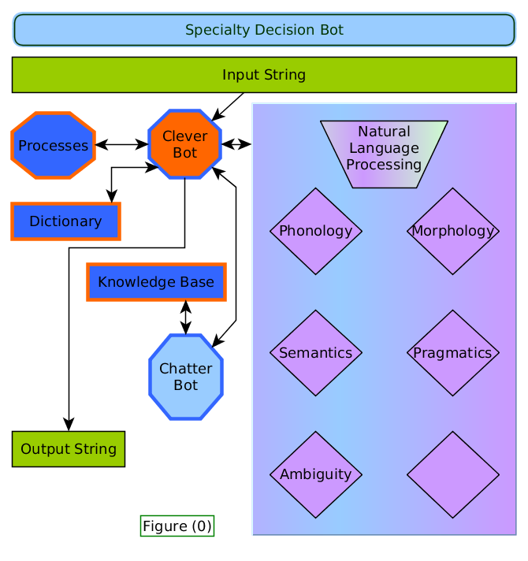

# 
 an NLP dependant Clever Bot for Critical Decision Affirmation
 

 the Developers ,'by alphabetical order': 

 Aly Shmahell, Alya Salman, Elias Soud Mohammad Shbani, Ruaa Sleiman, Sarah Ammar 

 the Supervisor: Dr. Hasan Ahmad 

 a 4 th year Project for the Dep. of Computer and Automatic Control Engineering @ Tishreen University 

 Documentation v(0.1) 

 26 th of November 2015of November 2015 

## License
Copyright 2015 The SpecDecBot Project (Aly Shmahell, Alya Salman, Elias Soud, Mohammad Shbani, Ruaa Sleiman, Sarah Ammar).

All rights reserved.

Redistribution and use in source (Graphml,svg,tex and so forth) and 'compiled' forms (HTML, PDF, PNG, JPG, PostScript, RTF and so forth) with or without modification, are permitted provided that the following conditions are met:
- Redistributions of source code (Graphml,svg,tex and other for- mats) must retain the above copyright notice, this list of conditions and the following disclaimer as the first lines of this file unmodified.
- Redistributions in compiled form (HTML, PDF, PNG, JPG, PostScript, RTF and other formats) must reproduce the above copyright notice, this list of conditions and the following disclaimer in the documen- tation and/or other materials provided with the distribution.

THIS DOCUMENTATION IS PROVIDED BY THE SPECDECBOT PROJECT "AS IS" AND ANY EXPRESS OR IMPLIED WAR- RANTIES, INCLUDING, BUT NOT LIMITED TO, THE IMPLIED WARRANTIES OF MERCHANTABILITY AND FITNESS FOR A PARTICULAR PURPOSE ARE DISCLAIMED. IN NO EVENT SHALL THE SPECDECBOT PROJECT BE LIABLE FOR ANY DIRECT, INDIRECT, INCIDENTAL, SPECIAL, EXEMPLARY, OR CONSEQUENTIAL DAMAGES (INCLUDING, BUT NOT LIM- ITED TO, PROCUREMENT OF SUBSTITUTE GOODS OR SER- VICES; LOSS OF USE, DATA, OR PROFITS; OR BUSINESS IN- TERRUPTION) HOWEVER CAUSED AND ON ANY THEORY OF LIABILITY, WHETHER IN CONTRACT, STRICT LIABIL- ITY, OR TORT (INCLUDING NEGLIGENCE OR OTHERWISE) ARISING IN ANY WAY OUT OF THE USE OF THIS DOCU- MENTATION, EVEN IF ADVISED OF THE POSSIBILITY OF SUCH DAMAGE.

## Preface
'I Think Therefor I Am', is the standard when defining human intelligence, and by far any intelligence.

How- ever, so far the intelligence we've encountered doesn't only think, but also feels, Something that has guided our passion and exploded in various forms of creativity.

but with great passion comes risk, the risk to make rash decisions, rookie mistakes. pulling all-nighters at the of- fice passionately trying to maximize the stock profits, or all those hours standing in the lab experimenting with life-saving medicinals and waiting for results, all that ex- haustion puts your decisions at jeopardy.

Human Error, is by far the most fatal, because we trust our decision so much we're willing to stake everything on them, but what happens when you're under pressure but can't perform optimally?

You need something both capable of carrying your tasks and understanding them in layman terms, and something that is cryptographically secure.

For that we present you dear user with SpecDecBot, an Artificial Agent capable of comprehending binary work- related questions using Natural Language Processing tech- niques and running them against specialty algorithms that perform optimally under all circumstances.

## Introduction
As illustrated in figure (0), the Project has an object- oriented work-flow, which goes as follows :
- an Input string is provided to a clever-bot.
- the clever-bot utilizes an NLP class to mine a dictionary and create a semantic tree for the input string.
- if the tree is successfully created, the bot uses the dictionary to link the tree with algorithms from the processes library.
- the algorithms use input from the semantic tree and answer the intended question in a binary matter.
- the bot uses the binary answer the NLP class, and the Dictionary to create a second semantic tree for an answer.
- the bot converts the answer's semantic tree to an output-string.
- in case the first semantic tree (the question's) is not created for reasons like "incomplete semantic tree, faulty input, or illogical input" or if the tree is incoherent, the clever-bot communicates with the user to try and correct the Error.

notice : the Clever-Bot performs Semantic-Tree oper- ations, String-Conversion and Algorithm-Linking opera- tions. however, it can also communicate with the user in an interactive manner using suggestions from an embedded Chatter-Bot.

